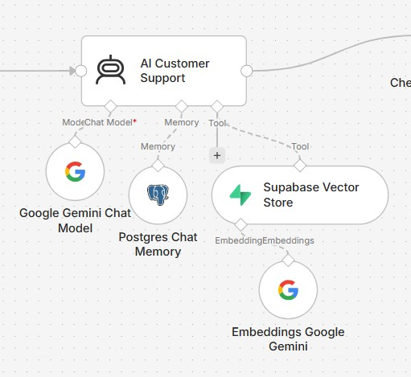
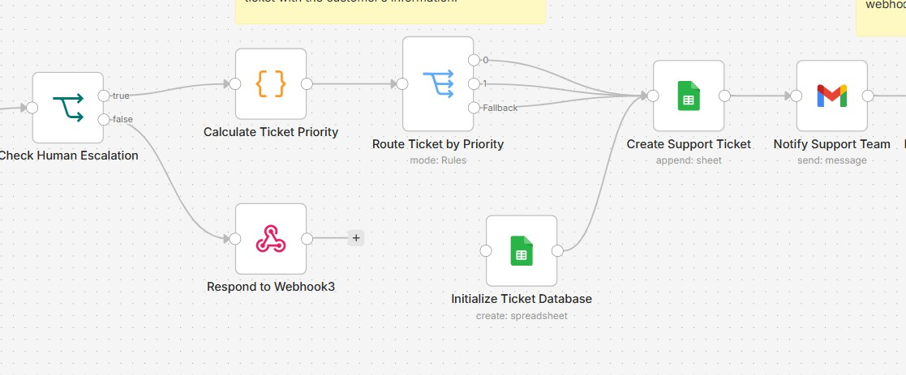
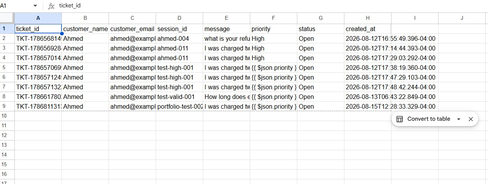

# AI-Powered Customer Support & Ticket Escalation Automation


The workflow identifies customer issues that require human assistance and automatically escalates them.


### 🚦 Automatic Ticket Prioritization


Escalated issues are automatically assigned one of three priorities:


- High
- Medium
- Low


### 🎫 Automatic Ticket Creation


When an issue requires human assistance, the workflow creates a support ticket containing the customer's information and issue details.


### 📧 Support Team Notification


The support team is automatically notified by email when a new support ticket is created.


### 📊 Google Sheets Ticket Management


Support tickets are stored in Google Sheets so they can easily be viewed and managed by support staff.


### 🌐 Webhook API


Customer requests can be submitted through a webhook endpoint, allowing the automation to be connected to websites, applications, chat systems, or other platforms.


### ✅ Input Validation


The workflow validates incoming customer information before processing the request.


---


## 🏗️ Workflow Architecture


```text
Customer Request
       ↓
Receive Customer Request
       ↓
Prepare Customer Data
       ↓
Validate Customer Request
       ↓
AI Customer Support
       ↓
Check Human Escalation
       │
       ├── Normal Request
       │       ↓
       │   Return AI Support Response
       │
       └── Human Escalation
               ↓
       Calculate Ticket Priority
               ↓
       Route Ticket by Priority
          ↙      ↓      ↘
       High    Medium    Low
          ↘      ↓      ↙
       Create Support Ticket
               ↓
       Notify Support Team
               ↓
       Prepare Ticket Response
               ↓
       Return Ticket Response
🧠 AI & RAG Architecture

The customer-support AI uses Retrieval-Augmented Generation (RAG).

The knowledge base is stored using Supabase and relevant information is retrieved before the AI generates its response.

Customer Question
       ↓
AI Customer Support
       ↓
Knowledge Retrieval
       ↓
Supabase Vector Store
       ↓
Gemini Embeddings
       ↓
Relevant Context
       ↓
Google Gemini
       ↓
Customer Response

This allows the AI to answer questions using information from the business knowledge base.

🛠️ Technologies Used
Technology	Purpose
n8n	Workflow automation
Google Gemini	AI customer-support responses
Gemini Embeddings	Knowledge-base embeddings
Supabase	Vector database and data storage
PostgreSQL	Persistent memory/data storage
Google Sheets	Support ticket management
Gmail	Support-team notifications
Webhooks	Customer request/API interface
RAG	Knowledge retrieval
📥 Example Customer Request
{
  "name": "Ahmed",
  "email": "ahmed@example.com",
  "session_id": "portfolio-test-001",
  "message": "What is your shipping time?"
}
💬 Example Normal Response
{
  "success": true,
  "type": "support_response",
  "message": "Your shipping information..."
}

For normal customer questions, the workflow returns an AI-generated response without creating a support ticket.

🚨 Example Escalation

Example customer message:

I was charged twice for my order and I need a human to help me.

The workflow automatically:

Detects that human intervention is required.
Calculates the ticket priority.
Assigns High priority.
Creates a support ticket.
Stores the ticket in Google Sheets.
Notifies the support team by email.
Returns the ticket information to the customer.
🚦 Ticket Priority System
Priority	Example Issues
High	Unauthorized charges, stolen accounts, security issues
Medium	Complaints, delayed orders, refunds, cancellations
Low	General support issues
📊 Ticket Management

Escalated tickets are stored in Google Sheets with information such as:

Ticket ID
Customer name
Customer email
Customer message
Priority
Ticket status
Other relevant support information

This gives the support team a simple way to track and manage escalated issues.

📧 Support Notification

When an issue is escalated, the workflow automatically sends an email notification to the support team.

This removes the need for a support employee to manually monitor incoming requests and create tickets.

🖼️ Screenshots
Workflow Overview
)
AI & Knowledge Base

Ticket Escalation

Ticket Results

🎯 Business Benefits

This automation can help businesses:

Reduce repetitive customer-support tasks.
Provide faster responses to customers.
Automatically answer common questions.
Retrieve accurate information from a knowledge base.
Identify important issues requiring human assistance.
Automatically prioritize support tickets.
Reduce manual ticket creation.
Notify support agents immediately.
Keep customer conversations organized.
Scale customer-support operations.
🔐 Security

This repository does not contain private API keys, passwords, database credentials, access tokens, or other sensitive information.

Anyone importing the workflow must configure their own credentials and integrations.

🧪 Testing

The workflow was tested successfully with:

Normal customer questions
High-priority escalations
Medium-priority escalations
Low-priority escalations
Invalid customer requests
Ticket creation
Google Sheets storage
Support-team email notifications
Structured API responses
📌 Project Status

Completed and tested successfully.

This project was built as a practical automation portfolio project demonstrating the integration of AI, RAG, databases, APIs, and business workflow automation.

👨‍💻 Skills Demonstrated

This project demonstrates practical experience with:

n8n workflow automation
AI automation
Google Gemini
RAG
Vector databases
Supabase
PostgreSQL
Webhooks
REST-style APIs
Google Sheets automation
Gmail automation
Conditional workflow routing
Ticket management
Error handling
Conversation memory
📂 Project Files

The repository contains:

ai-customer-support-n8n/
│
├── README.md
│
├── screenshots/
│   ├── complete workflow.jpg
│   ├── Ai knowledge based rag-system.jpg
│   ├── ticket automation.jpg
│   └── results.jpg
│
└── workflow/
    └── customer-support-workflow.json
⭐ Conclusion

This project demonstrates how n8n and AI can be used to build a complete customer-support automation rather than just a basic chatbot.

The system combines AI-powered responses, knowledge retrieval, conversation memory, automated escalation, ticket prioritization, ticket management, and support-team notifications into a single automated workflow.
